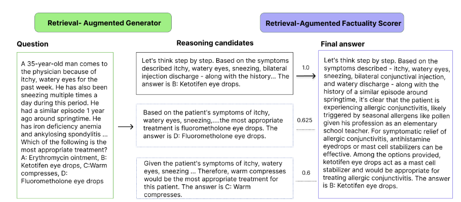

# RARE: Retrieval-Augmented Reasoning Enhancement for Large Language Models

This repository contains necessary scripts to run **RARE**.

[//]: # (> Link to paper: https://huggingface.co/papers/2408.06195, https://arxiv.org/abs/2408.06195 )

## Intro 

We propose **RARE**, Retrieval-Augmented Reasoning Enhancement for Large Language Models approach that significantly improves reasoning and factuality capabilities of large language models without fine-tuning or superior models.

<p align="center">
  
</p>

## Prerequisites

- Python 3.10
- CUDA 12
- newest PyTorch
- newest `transformers`
- newest `vllm`

## Usage

### RARE

Here is an example to run RARE:

```bash
bash scripts/run_generate_medqa_8b.sh
```

The script `run_gsm8k_generator.sh` includes several configurable parameters:
- `--dataset_name`: Name of the dataset (choose from [MATH, GSM8K, GSM8KHARD, STG, SVAMP, MULTIARITH]).
- `--test_json_filename`: Filename for the test JSON (default: test).
- `--model_ckpt`: Path to the model checkpoint.
- `--note`: Additional note to mark the output folder. Without further arguments, the generator output folder will be `./run_outputs/<dataset_name>/<model_ckpt>/<execute_time>---[<note>]`
- `--num_rollouts`: Number of rollouts (default: 4).

Make sure to adjust these parameters according to your requirements.